idea使用docker将Java项目生成镜像并使用

### 1：开启docker 远程访问

- 使用 vim 编辑docker服务配置文件


`vim /lib/systemd/system/docker.service`

```
[Service]
Type=notify
# the default is not to use systemd for cgroups because the delegate issues still
# exists and systemd currently does not support the cgroup feature set required
# for containers run by docker
ExecStart=/usr/bin/dockerd -H fd:// --containerd=/run/containerd/containerd.sock 
ExecReload=/bin/kill -s HUP $MAINPID
TimeoutStartSec=0
RestartSec=2
Restart=always
```

修改 `ExecStart` 添加 ` -H tcp://0.0.0.0:2375`

```
[Service]
Type=notify
# the default is not to use systemd for cgroups because the delegate issues still
# exists and systemd currently does not support the cgroup feature set required
# for containers run by docker
ExecStart=/usr/bin/dockerd -H fd:// --containerd=/run/containerd/containerd.sock -H tcp://0.0.0.0:2375 
ExecReload=/bin/kill -s HUP $MAINPID
TimeoutStartSec=0
RestartSec=2
Restart=always
```

重新加载docker配置并重启服务

`systemctl daemon-reload && systemctl restart docker`

然后直接在命令行客户端输入如下命令进行测试，IP地址改为自己的

`curl http://192.168.56.20:2375/version`

出现如下信息则代表修改Docker服务设置远程访问成功。

```
{
  "Platform": {
    "Name": "Docker Engine - Community"
  },
  "Components": [
    {
      "Name": "Engine",
      "Version": "26.0.0",
      "Details": {
        "ApiVersion": "1.45",
        "Arch": "amd64",
        "BuildTime": "2024-03-20T15:17:48.000000000+00:00",
        "Experimental": "false",
        "GitCommit": "8b79278",
        "GoVersion": "go1.21.8",
        "KernelVersion": "5.15.0-101-generic",
        "MinAPIVersion": "1.24",
        "Os": "linux"
      }
    },
    {
      "Name": "containerd",
      "Version": "1.6.28",
      "Details": {
        "GitCommit": "ae07eda36dd25f8a1b98dfbf587313b99c0190bb"
      }
    },
    {
      "Name": "runc",
      "Version": "1.1.12",
      "Details": {
        "GitCommit": "v1.1.12-0-g51d5e94"
      }
    },
    {
      "Name": "docker-init",
      "Version": "0.19.0",
      "Details": {
        "GitCommit": "de40ad0"
      }
    }
  ],
  "Version": "26.0.0",
  "ApiVersion": "1.45",
  "MinAPIVersion": "1.24",
  "GitCommit": "8b79278",
  "GoVersion": "go1.21.8",
  "Os": "linux",
  "Arch": "amd64",
  "KernelVersion": "5.15.0-101-generic",
  "BuildTime": "2024-03-20T15:17:48.000000000+00:00"
}

```

**特别注意的点：** 完全开放Docker对外访问权限有可能会遭到别人攻击，这是很不安全的，只要别人知道你的服务器地址就能够随意连接你的Docker服务，而不需要任何认证，因此，完全开放只推荐自己在内网使用，不推荐在云服务器上直接完全开放。

在使用 `docker info` 命令时，会报警告

```
[DEPRECATION NOTICE]: API is accessible on http://0.0.0.0:2375 without encryption.
         Access to the remote API is equivalent to root access on the host. Refer
         to the 'Docker daemon attack surface' section in the documentation for
         more information: https://docs.docker.com/go/attack-surface/
In future versions this will be a hard failure preventing the daemon from starting! Learn more at: https://docs.docker.com/go/api-security/
```

`在未来的版本中，这将是一个阻止守护进程启动的硬故障,`

暂时先不管。

2：在idea安装docker插件在idea安装docker插件

idea在2023.3.3版本已经内置了docker，其他版本自行下载即可
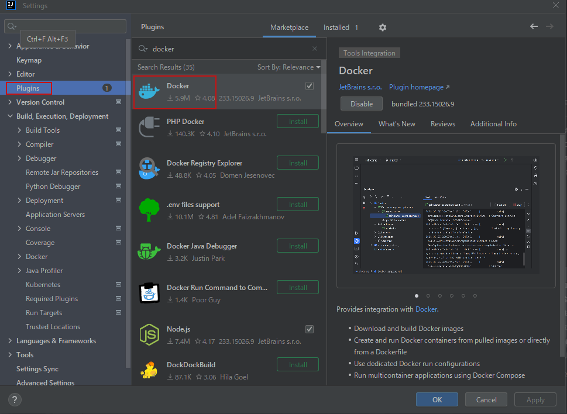

3：在项目下创建Dockerfile文件（与pom.xml同目录）

这里最好放在``pom.xml``同级目录下，指定文件方便，如果单独放一个文件夹，指定路径的jar会报找不到，需要将打包的jar手动丢进去。
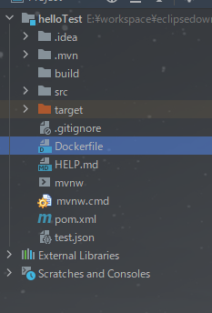

Dockerfile文件内容
```
#设置引用的jdk环境容器
FROM jdk:17
#FROM centos7-java17:latest
LABEL version="1.0"
LABEL description=" hello world docker "
#目录是终端默认在此目录下
WORKDIR /app

#如果是到文件夹后面必须加上“/”,不然会找不到文件，./代表当前目录即是/app
COPY target/helloTest-0.0.1-SNAPSHOT.jar helloTest.jar
#开机执行
ENTRYPOINT ["java", "-jar", "helloTest.jar"]

```
6：``Dockerfile``文件``FROM``位置的绿色双箭头，去配置链接docker服务
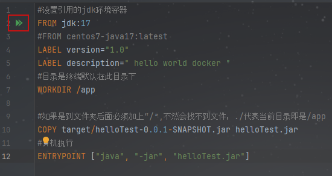
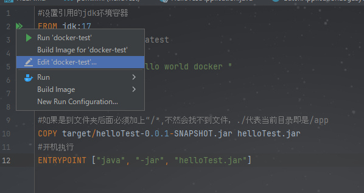
```
Dockerfile : 指定 Dockerfile文件地址
Image tag : 设置上传到docker的镜像名称
Container name: 设置容器名称
Bind ports: 配置的端口绑定。例如，如果您已经在Docker主机端口5432上运行PostgreSQL，则可以将主机上的端口5433映射到容器内的5432，如前面的屏幕截图所示。这将使PostgreSQL在容器内运行，通过主机上的端口5433可访问。

```
点击 + 号，创建一个新连接
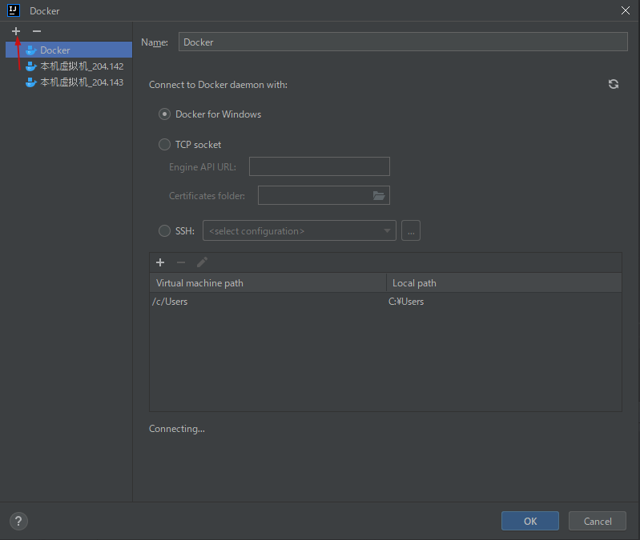

选择 ``TCP socket`` 连接，
输入 服务器的IP地址 + ``2375`` 端口号
```tcp://192.168.204.143:2375```

输入后，idea 会立即连接，如果成功，会显示
```Connection successful```

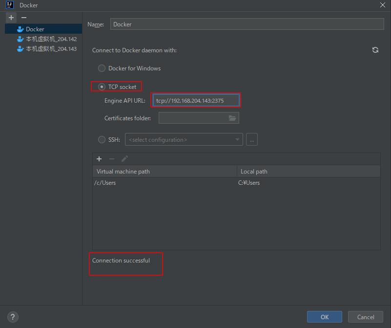

点击OK保存后，点击RUN 运行
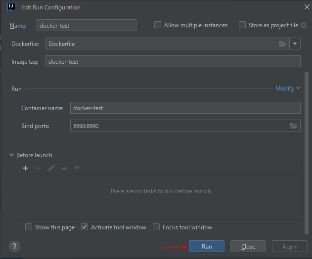

这里显示的 ``Step`` ，是在``dockerfile``中写的命令，命令有几个，``Step`` 就有几个。
正常 ``Step`` 步骤执行完后，打包就OK 了。
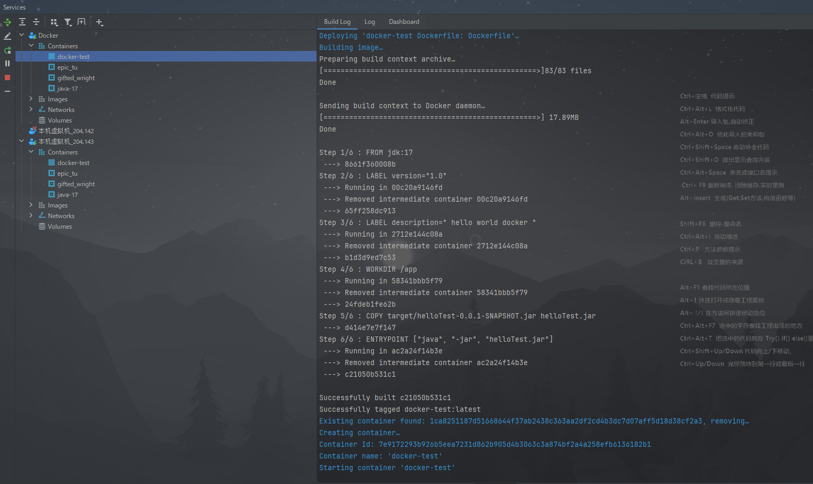
随后会立即启动
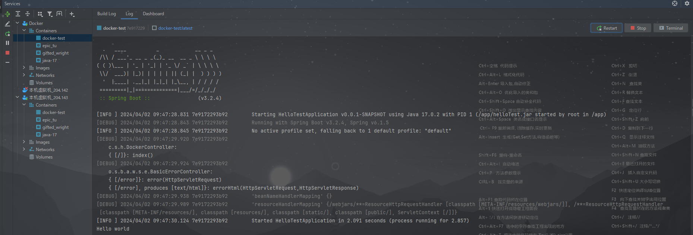

显示 ``hello world`` 表示启动成功

从浏览器访问测试
`http://192.168.204.143:8990/
`
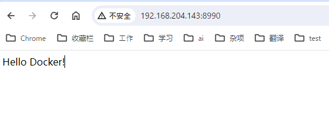

再看控制台
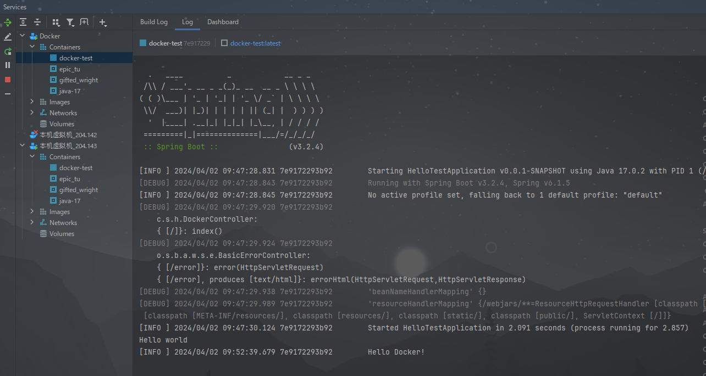

执行``controller`` 方法成功。

-----end-----

## 后记：
我在pom.xml上加了 docker的插件，但是并不好用，实际上还是要单独提交。只是打了jar。

博客地址
``https://blog.csdn.net/qq_41886200/article/details/137256661?spm=1001.2014.3001.5501``


